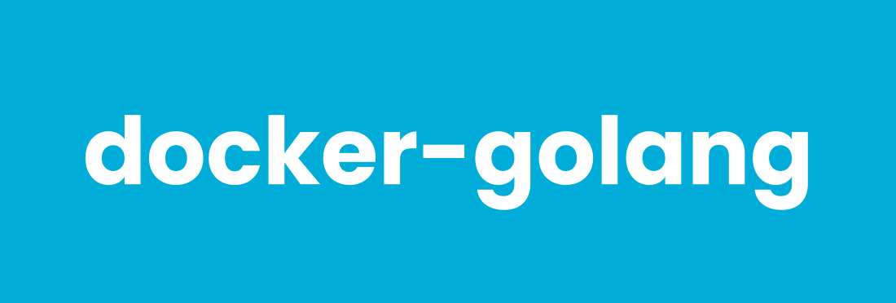

# docker-golang



[](https://github.com/ragedunicorn/docker-golang/actions/workflows/docker_release.yml)
[](https://github.com/ragedunicorn/docker-golang/actions/workflows/test.yml)


> Docker Alpine image with the Go toolchain.


## Overview

This Docker image provides the Go toolchain built on Alpine Linux. It ships the official upstream Go release, downloaded from `dl.google.com` and verified against the Go release signatures at build time, rather than Alpine's `go` package — so the Go version is fixed independently of the Alpine release. Alpine 3.24 ships Go 1.26, and waiting for the next Alpine release to follow the six-month Go cadence would leave the image a full minor behind.

A C toolchain (`gcc`, `musl-dev`) and `git` are included, so `go get`, `CGO_ENABLED=1` builds and `go test -race` all work without extending the image.

## Features

- **Small footprint**: compact image using Alpine Linux
- **Go 1.27.0**: pinned upstream release, updated independently of Alpine
- **Cgo ready**: `gcc` and `musl-dev` included, so cgo and the race detector work out of the box
- **Module aware**: `git` for VCS module paths, and a pre-created cache tree at `/go`
- **Non-root user**: Enhanced security with dedicated golang user
- **Volume mounting**: Easy code and data access through `/app`

## Quick Start

```bash
# Pull the image
docker pull ragedunicorn/golang:latest

# Print the Go version (default command)
docker run --rm ragedunicorn/golang:latest

# Build the code in the current directory
docker run --rm -v "$(pwd):/app" ragedunicorn/golang:latest build ./...
```

For development and building from source, see [DEVELOPMENT.md](DEVELOPMENT.md).

## Usage

The container uses `go` as the entrypoint, so any Go subcommand can be passed directly to the `docker run` command.

### Basic Usage

**Linux/macOS:**

```bash
# Using latest version
docker run --rm -v "$(pwd):/app" ragedunicorn/golang:latest [go-subcommand]

# Using exact version combination
docker run --rm -v "$(pwd):/app" ragedunicorn/golang:1.27.0-alpine3.24.1-1 [go-subcommand]
```

**Windows (PowerShell):**

```powershell
docker run --rm -v "${PWD}:/app" ragedunicorn/golang:latest [go-subcommand]
```

### Examples

#### Check the Go Version
```bash
docker run --rm ragedunicorn/golang:latest version
```

#### Run a Program
```bash
docker run --rm -v "$(pwd):/app" ragedunicorn/golang:latest run main.go
```

#### Build a Module
```bash
# The named volume keeps the module and build cache between runs, so
# dependencies are not re-downloaded and packages are not recompiled every
# time. A fresh volume is initialized owned by the golang user (the image
# pre-creates /go).
docker run --rm -v "$(pwd):/app" -v gocache:/go ragedunicorn/golang:latest build ./...
```

#### Run Tests
```bash
docker run --rm -v "$(pwd):/app" -v gocache:/go ragedunicorn/golang:latest test ./...

# With the race detector (needs the bundled C toolchain)
docker run --rm -v "$(pwd):/app" -v gocache:/go ragedunicorn/golang:latest test -race ./...
```

#### Format and Vet
```bash
docker run --rm -v "$(pwd):/app" --entrypoint gofmt ragedunicorn/golang:latest -l .
docker run --rm -v "$(pwd):/app" -v gocache:/go ragedunicorn/golang:latest vet ./...
```

#### Install a Tool into the Cache Volume
```bash
docker run --rm -v "$(pwd):/app" -v gocache:/go ragedunicorn/golang:latest install golang.org/x/tools/cmd/stringer@latest
```

#### Interactive Shell
```bash
docker run -it --rm -v "$(pwd):/app" --entrypoint /bin/sh ragedunicorn/golang:latest
```

## Cgo and Portable Binaries

The image is Alpine based, so its C library is musl, not glibc. Cgo is enabled by default (the C toolchain is present), which means a default `go build` of a package that uses cgo produces a **musl-linked** binary that will not run on a glibc host such as Debian or Ubuntu.

For a fully static binary that runs anywhere, disable cgo:

```bash
docker run --rm -v "$(pwd):/app" -v gocache:/go \
  -e CGO_ENABLED=0 \
  ragedunicorn/golang:latest build -o app ./cmd/app
```

If you need a glibc-linked binary, build it in a glibc-based image instead — that is a base image choice, not something this image can switch at runtime.

`g++` is not installed. The handful of cgo packages that need a C++ compiler can add it in a derived image (`apk add --no-cache g++`).

> **Note (Docker Desktop for Windows):** overwriting existing files on a
> Windows bind mount can fail with `Operation not permitted` for the non-root
> `golang` user. If your build writes into the mounted workspace, run as root
> and move the cache volume to the root GOPATH:
>
> ```powershell
> docker run --rm -u root -v "${PWD}:/app" -v gocache-root:/go ragedunicorn/golang:latest build ./...
> ```

## Environment

The Go environment is set explicitly in the image rather than derived from `$HOME`, so the toolchain works even when `HOME` is unset:

| Variable | Value | Notes |
|---|---|---|
| `GOPATH` | `/go` | Pre-created and owned by the `golang` user |
| `GOMODCACHE` | `/go/pkg/mod` | Downloaded modules |
| `GOCACHE` | `/go/cache` | Build cache |
| `GOTOOLCHAIN` | `local` | No implicit toolchain downloads |

Because the whole cache tree lives under `GOPATH`, a single named volume mounted at `/go` covers both the module cache and the build cache.

`GOTOOLCHAIN=local` means a `go.mod` requiring a newer Go than the image ships fails loudly instead of silently downloading another toolchain. Override it if you want the default upstream behaviour:

```bash
docker run --rm -v "$(pwd):/app" -v gocache:/go -e GOTOOLCHAIN=auto ragedunicorn/golang:latest build ./...
```

## Git and VCS Stamping

`go build` stamps the VCS revision into the binary by default (`-buildvcs=auto`), which means it runs `git` against your mounted source tree. A bind mount belongs to the host user rather than to the `golang` user inside the container, and git normally refuses such a repository with `detected dubious ownership`, failing the build.

The image therefore marks every directory as safe (`git config --system --add safe.directory '*'`), so builds of a real checkout work unchanged and the revision is stamped as expected:

```bash
docker run --rm -v "$(pwd):/app" -v gocache:/go ragedunicorn/golang:latest build ./...
docker run --rm -v "$(pwd):/app" -v gocache:/go ragedunicorn/golang:latest version -m ./app
```

Pass `-buildvcs=false` if you would rather not stamp VCS information at all.

## Docker Compose Usage

This repository includes Docker Compose configurations for easier usage and common Go workflows.

### Basic Setup

1. Create an `app` directory:
```bash
mkdir -p app
```

2. Place your Go code in `app/`

3. Run Go using docker compose:
```bash
docker compose run --rm golang build ./...
docker compose run --rm golang test ./...
```

### Example Configuration

The `examples/` directory contains a hello-world example:

#### Hello World Example (`examples/docker-compose.yml`)
```bash
# Run the hello world example
cd examples && docker compose run --rm hello-world
```

### Environment Variables

The compose configuration supports:

- `GOLANG_VERSION`: Specify the Go image version (default: latest)
- `TERM`: Terminal type for colored output

### Tips

1. **Custom Commands**: Override the default command:
   ```bash
   docker compose run --rm golang env GOVERSION
   ```

2. **Development Mode**: Use the development compose file for building locally:
   ```bash
   docker compose -f docker-compose.dev.yml build
   docker compose -f docker-compose.dev.yml run --rm golang-dev
   ```

3. **Persistent Settings**: The repository includes a `.env` file with default settings:
   ```env
   GOLANG_VERSION=latest
   ```

## Building Custom Images

This image is a toolchain image. The usual pattern is to use it as a build stage and ship the resulting binary in a minimal runtime image:

```dockerfile
FROM ragedunicorn/golang:latest AS build

WORKDIR /app
COPY --chown=golang:golang . .
RUN CGO_ENABLED=0 go build -o /go/bin/app ./cmd/app

FROM alpine:3.24.1
COPY --from=build /go/bin/app /usr/local/bin/app
ENTRYPOINT ["app"]
```

To add packages to a derived image, switch users temporarily:

```dockerfile
FROM ragedunicorn/golang:latest

USER root
RUN apk add --no-cache g++
USER golang
```

## Versioning

This project uses semantic versioning that matches the Docker image contents:

**Format:** `{go_version}-alpine{alpine_version}-{build_number}`

Examples:
- `1.27.0-alpine3.24.1-1` - Go 1.27.0 on Alpine 3.24.1, build 1
- `1.27.0-alpine3.24.1-2` - Rebuild of the same versions (fixes, optimizations)
- `1.27.0` - Bare Go version, tracking the most recent build of that release
- `latest` - Most recent stable release

For detailed release process and versioning guidelines, see [RELEASE.md](RELEASE.md).

## Automated Dependency Updates

This project uses [Renovate](https://docs.renovatebot.com/) to automatically check for updates to:
- Alpine Linux base image version (all major, minor, and patch updates)
- The pinned Go release, tracked through the `GO_VERSION` build arg

Renovate runs weekly (every Monday) and creates pull requests when updates are available. Every Alpine reference is kept in sync from a single update: the `FROM` line, the `org.opencontainers.image.base.name` OCI label, and the Alpine version asserted in `test/golang_metadata_test.yml` are grouped into one pull request. The Go references are grouped the same way — the `GO_VERSION` build arg and the exact version asserted in `test/golang_command_test.yml` move together, so a bump never lands as a green build arg alongside a red test. Go patch releases are merged automatically; minor bumps are reviewed by hand, since Go supports only the last two minors and moving between them is a deliberate decision.

## Documentation

- [Development Guide](DEVELOPMENT.md) - Building, debugging, and contributing
- [Testing Guide](TEST.md) - Running and writing tests
- [Release Process](RELEASE.md) - Creating releases and versioning

## Links

- [Go Documentation](https://go.dev/doc/)
- [Go Downloads](https://go.dev/dl/)
- [Alpine Linux](https://www.alpinelinux.org/)

# License

MIT License

Copyright (c) 2026 Michael Wiesendanger

Permission is hereby granted, free of charge, to any person obtaining a copy
of this software and associated documentation files (the "Software"), to deal
in the Software without restriction, including without limitation the rights
to use, copy, modify, merge, publish, distribute, sublicense, and/or sell
copies of the Software, and to permit persons to whom the Software is
furnished to do so, subject to the following conditions:

The above copyright notice and this permission notice shall be included in all
copies or substantial portions of the Software.

THE SOFTWARE IS PROVIDED "AS IS", WITHOUT WARRANTY OF ANY KIND, EXPRESS OR
IMPLIED, INCLUDING BUT NOT LIMITED TO THE WARRANTIES OF MERCHANTABILITY,
FITNESS FOR A PARTICULAR PURPOSE AND NONINFRINGEMENT. IN NO EVENT SHALL THE
AUTHORS OR COPYRIGHT HOLDERS BE LIABLE FOR ANY CLAIM, DAMAGES OR OTHER
LIABILITY, WHETHER IN AN ACTION OF CONTRACT, TORT OR OTHERWISE, ARISING FROM,
OUT OF OR IN CONNECTION WITH THE SOFTWARE OR THE USE OR OTHER DEALINGS IN THE
SOFTWARE.
